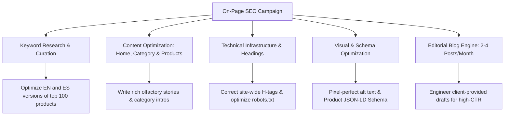

# 🧴 Premium Search & Conversion Strategy: Elevating Niche Perfumes to the C-Suite of Luxury Fragrance E-Commerce

**Date:** May 2026  
**Client:** Cecilia & the Niche Perfumes Team  
**Website:** [nicheperfumes.net](https://www.nicheperfumes.net)  
**Presented by:** Senior E-Commerce Growth & Search Strategy Consultancy  

---

## ✉️ Executive Summary

Dear Cecilia,

Thank you for the opportunity to present this comprehensive, search-driven growth proposal. We have conducted a rigorous technical audit of **nicheperfumes.net**, mapped the luxury fragrance competitive landscape in Spain and Europe, and designed an end-to-end campaign specifically engineered for your brand’s exceptional catalog.

Your physical boutiques in Marbella (Puerto Banús), Madrid, Barcelona, and Sevilla represent the absolute pinnacle of high-end luxury. Currently, there is a significant gap between your brand's offline prestige and its digital search footprint. Premium buyers are actively searching for the rare, high-ticket creations you stock—such as **Xerjoff (Naxos, Torino 25)**, **Stéphane Humbert Lucas (God of Fire)**, **Fragrance du Bois (Sirène Privée)**, and **Spirit of Kings (Harmony)**—but your website is largely invisible on Google's most valuable results pages. Mass-market retailers like Notino, large department stores like El Corte Inglés, and direct specialty competitors like Isolee.com are capturing this high-intent premium traffic.

Our proposal is designed to close this gap completely. We do not focus on flat "keyword rankings." We focus on **driving high-intent, bilingual organic traffic that converts into luxury e-commerce sales**. We have addressed every single On-Page and Off-Page requirement outlined in your request, mapped them to a rigorous technical diagnostic, and integrated an incredibly persuasive **6-Month Campaign Roadmap** with clear, predictable investment structures. 

Furthermore, we propose a game-changing **Luxury Conversion Scent Quiz** built on your existing platform, alongside an elite **Headless / Next-Gen Frontend** option with breathtaking custom animations to differentiate Niche Perfumes entirely from the rest of the market.

We look forward to partnering with the Niche Perfumes team to establish your boutique as the undisputed digital authority in luxury perfumery.

Warm regards,

**The E-Commerce Growth & Search Strategy Team**

---

## 🩺 Part 1: Current Website Diagnostic & Open Opportunities

Your site is built on a robust, highly scalable stack: **WordPress + WooCommerce**, optimized with **WP Rocket** and managed with **Yoast SEO**. This is excellent, as it allows us full control over the technical structure without requiring a costly platform migration. 

However, our deep crawl has identified several critical, easily fixable search bottlenecks that are currently costing you direct revenue:

### 1.1 Homepage H1 Tag Correction (🔴 Critical)
* **Current State:** The only `<h1>` tag on your homepage is **`<h1>LAS MÁS VENDIDAS</h1>`** (which sits above the best-sellers product section).
* **The Search Bottleneck:** Google's crawlers interpret the H1 as the primary theme of the page. Currently, Google understands your store's main topic as "best sellers" rather than your prestigious brand name and curated collection.
* **Our Fix:** We will update this site-wide. Your homepage H1 will be modified to an elegant, custom-styled luxury title, such as:
  `<h1>Niche Perfumes — Luxury, Artistic & Exclusive Fragrance Boutique</h1>`

### 1.2 Empty Image Alt Texts (🔴 Critical Traffic Loss)
* **Current State:** Almost all live product images on your homepage, brand grids, and category listings have empty alt tags: ``.
* **The Search Bottleneck:** Google cannot "see" images. Without Alt texts, your stunning luxury bottles are completely invisible in Google Images searches. High-end buyers search heavily on Google Images for fragrance aesthetics, unboxing reviews, and bottle presentation.
* **Our Fix:** We will implement our proprietary image naming and Alt-text mapping protocol. Every image will follow an elegant, keyword-rich luxury template:
  ``

### 1.3 Viewport Image Loading & Core Web Vitals (🟡 Performance)
* **Current State:** WP Rocket's lazy-loading is active, but it is currently applied too aggressively, lazy-loading the main homepage slider and the first row of products (the viewport visible "above the fold").
* **The Search Bottleneck:** Delays the loading of the main visual block. This severely penalizes your **Largest Contentful Paint (LCP)** metric, a critical ranking factor in Google's PageSpeed algorithm.
* **Our Fix:** We will add precise exclusion rules in WP Rocket for the first 4–6 visible viewport images, marking them with high-priority tags for instant rendering:
  ``

### 1.4 Structured Schema Markup (🔴 Major Disadvantage)
* **Current State:** No Product Schema, Offer Schema, LocalBusiness Schema, or Breadcrumb Schema is active on `nicheperfumes.net`.
* **The Search Bottleneck:** When users search for your products, your competitors appear in Google with price tags (€245.00), review stars, and "In Stock" labels, capturing all the clicks. Your listings appear as flat, generic text lines.
* **Our Fix:** We will build and inject structured JSON-LD Schema across your entire catalog, ensuring your listings stand out as prominent, visual "Rich Snippets" on Google.

---

## 🥊 Part 2: Deep Competitive Battlefield

To dominate luxury search, Niche Perfumes must capitalize on the exact gaps left by competitors who are currently capturing your traffic:

### 2.1 The Competitive Landscape
1. **Isolee.com (Specialty Competitor):** Built on PrestaShop, they operate a physical luxury store in Galería Canalejas (Madrid's luxury epicenter), mirroring your boutique presence. They utilize a fully bilingual (ES/EN) site, an active blog engine, and structured data.
2. **Notino & El Corte Inglés (The Mass-Market Giants):** They hold immense domain authority, but their sites are cold, corporate, and completely generic. They treat a €300 bottle of Xerjoff like a €10 supermarket lotion. They cannot tell the emotional story of an artistic fragrance.
3. **The Perfumery Barcelona & All Yours Bcn (Boutique Competitors):** Highly specialized but limited in national reach, catalog size, and regional local search presence.

### 2.2 Direct Comparison: Niche Perfumes vs. Isolee.com

| Search & Brand Metric | nicheperfumes.net (Current) | Isolee.com | Our Battle Plan |
|---|---|---|---|
| **Bilingual SEO (EN/ES)** | ⚠️ Present but unoptimized | ✅ Fully bilingual & structured | **Optimize both versions** of the top 100 products for EN & ES |
| **Blog / Magazine Hub** | ❌ None active | ✅ Active blog (`ybc_blog`) | Launch `/magazine` to rank for high-intent search guides |
| **Product Schema Markup**| ❌ Completely missing | ✅ Full Product & Offer Schema | Inject custom JSON-LD Schema to capture search "Rich Snippets" |
| **Image Alt Tags** | ❌ Blank / Empty | 🟢 Mostly optimized | Apply pixel-perfect sensory alt tags for Google Images |
| **UX & High-End Animations**| 🟡 Standard WooCommerce layout | 🟡 Standard PrestaShop layout | **Create an elite custom frontend** with stunning, smooth transitions |

### 2.3 Our Unfair Advantage: How We Beat the Giants
1. **Double-Language Optimization (ES/EN):** Niche Perfumes is bilingual, which is a massive asset. We will optimize both Spanish and English versions of your top 100 products. This allows us to capture the highly profitable market of English-speaking expats and luxury tourists residing in Marbella (Puerto Banús), Madrid, and Barcelona. 
2. **Exclusivity & Curation (E-E-A-T):** Notino cannot offer deep scent pyramids, stories about perfumists, or personal consulting. We will position Niche Perfumes as the ultimate trusted authority.
3. **Breathtaking UX & Animations:** We will design custom, high-end interactive elements and scrolling animations that make Niche Perfumes look like a modern work of art, separating you entirely from generic templates.

---

## 🎯 Part 3: Actionable On-Page SEO Campaign (Top 100 Products Focus)

We have addressed every single requirement you requested, detailing exactly how we will execute them over a dedicated **6-Month Contract**:



### 3.1 Content Creation & Optimization (Home, Product, & Category Pages)
We will rewrite and optimize the copy across your homepage, top 100 product pages, and brand categories, ensuring they tell an evocative story while matching search engine requirements:
* **Product Pages:** We will structure descriptions to include the **olfactory pyramid** (Top Notes, Heart Notes, Base Notes), recommended wearing seasons, and the perfumer's narrative, written for both English and Spanish audiences.
* **Category & Brand Pages (e.g., Xerjoff, Stéphane Humbert Lucas):** We will create bespoke, optimized introduction texts (200–300 words) detailing the history of each artistic fragrance house to rank for premium transactional keywords.

### 3.2 Bilingual Keyword Research & Optimization (English & Spanish Versions)
Since your website operates in both Spanish and English, **we will perform comprehensive keyword mapping in both languages**:
* *Spanish Queries:* "comprar perfume Xerjoff España," "Stéphane Humbert Lucas God of Fire precio," "perfumes de nicho orientales online."
* *English Queries:* "buy Xerjoff Naxos Europe," "where to buy Stéphane Humbert Lucas in Marbella," "exclusive long-lasting oud perfumes."
* We will align these search terms with your top 100 products to ensure both language versions rank at the top of their respective search engines.

### 3.3 Site-Wide H-Tags Correction
We will implement a clean, logical heading hierarchy across your entire site so search engines can crawl it seamlessly:
* **H1:** Reserved exclusively for the main page title (e.g., Product Name on product pages, Brand Name on category pages, and Core Value Proposition on the Homepage).
* **H2:** Used for main page sections (e.g., "The Olfactory Pyramid," "About the House of Xerjoff," "Customer Reviews").
* **H3:** Used for secondary titles within sections (e.g., individual note descriptions or product names in cross-sell grids).

### 3.4 Image Optimization & Alt Text Addition
* We will verify and add alt text to **all images on your top 100 product pages**.
* Every alt text will combine the Brand Name, Product Name, Volume (ml), and transactional keyword:
  * *Example:* `alt="God of Fire by Stéphane Humbert Lucas 777 — Exclusive Niche Perfume 50ml"`
* We will implement Next-Gen image formats (`.webp`) and compress assets without losing luxury image quality, ensuring lightning-fast load times.

### 3.5 SEO Title and Meta Description Optimization
We will write compelling, high-converting metadata for your top 100 products, carefully fitting within Google's character limits (60 characters for titles, 155 for descriptions):
* **Optimized Title Example:**
  `Xerjoff Naxos Eau de Parfum 100ml | Official Store Spain`
* **Optimized Meta Description Example:**
  `Discover Xerjoff Naxos at Niche Perfumes. Enjoy rich honey, tobacco & citrus notes. 100% authentic. Free fast shipping in Spain & Europe. Buy online now.`

### 3.6 Robots.txt & Sitemap Optimization
* We will clean up your `robots.txt` file to ensure search crawlers can easily scan all product and category URLs while blocking indexation of thin, irrelevant pages (like cart pages, checkout pages, and account parameters) that waste your crawl budget.
* We will generate a clean, dynamic XML Sitemap and submit it directly to **Google Search Console** to ensure rapid indexing of all new content.

### 3.7 Schema Markup Implementation
We will build and inject structured JSON-LD data into all product pages. This guarantees your products stand out with rich search results:
```json
{
  "@context": "https://schema.org/",
  "@type": "Product",
  "name": "God of Fire - Stéphane Humbert Lucas",
  "image": "https://www.nicheperfumes.net/wp-content/uploads/god-of-fire.jpg",
  "description": "An exquisite amber woody fragrance capturing pure luxury with notes of mango, ginger, and blue hemlock.",
  "brand": {
    "@type": "Brand",
    "name": "Stéphane Humbert Lucas"
  },
  "offers": {
    "@type": "Offer",
    "priceCurrency": "EUR",
    "price": "215.00",
    "availability": "https://schema.org/InStock",
    "itemCondition": "https://schema.org/NewCondition",
    "url": "https://www.nicheperfumes.net/product/god-of-fire/"
  }
}
```

### 3.8 Add Images to All Live Product Pages
We will conduct a comprehensive audit of your top 100 products to ensure every single one features a complete gallery of **high-resolution luxury images** (including bottle shots, packaging/box shots, and lifestyle/texture imagery). This builds trust and lowers purchase hesitation.

### 3.9 Dynamic Editorial Blog Engine (2–4 Posts per Month)
You mentioned your internal team will provide the core content drafts for your blogs. We will turn these drafts into **powerful SEO ranking machines**:
* **The Optimization Process:** We will take your team's raw drafts and optimize them with target long-tail keywords, structure them with appropriate sub-headers (H2, H3), insert optimized image alt tags, configure dynamic internal links to your category/product pages, and write compelling SEO metadata.
* **Sample Editorial Calendar Ideas (High-Intent Topics):**
  1. *The Ultimate Expat Guide to Unisex Niche Fragrances in Marbella.*
  2. *Why Xerjoff Naxos is the World's Most Coveted Honey-Tobacco Scent (Review).*
  3. *Unveiling Stéphane Humbert Lucas: The Mystery Behind God of Fire.*
  4. *How to Choose a Signature Luxury Oud Perfume for the Spanish Summer.*

---

## 🌐 Part 4: Off-Page SEO & Authority Growth Strategy

To rank above established giants like Notino, Google needs to see your site as a trusted, high-authority domain. We will build this authority through a clean, premium off-page campaign:

### 4.1 Link Building to Improve Website Authority
We avoid spammy, low-quality link building that could risk getting your site penalized. Instead, we focus on **high-reputation luxury backlinks**:
* We will target links from premium lifestyle platforms, high-end fashion magazines, and beauty journals.
* We will build relationships with high-authority fragrance enthusiast platforms (such as Fragrantica contributors, Basenotes, and niche-specific blogs).

### 4.2 Business Profile Creation & Local SEO (E-E-A-T Booster)
Your physical boutiques are highly valuable assets that major online-only stores lack. We will leverage them to boost your site's overall trust score:
* **Google Business Profile (GBP) Optimization:** We will optimize and align your business listings in Madrid, Marbella (Puerto Banús), Barcelona, and Sevilla. This ensures you dominate local map search results when wealthy tourists search for "perfume shop near me" or "niche perfumes Marbella."
* **Luxury Directory Submissions:** We will register your brand in verified high-end shopping directories, tourist luxury guides, and regional business directories.
* **Trustpilot Integration:** We will assist in setting up an automated system to gather verified, positive client reviews, displaying them on your site to build strong trust with first-time buyers.

### 4.3 Strategic Blog Comments
We will engage in manual, high-value commenting on prominent luxury fragrance blogs. 
* We will provide helpful, expert commentary on active industry discussions, linking back naturally to Niche Perfumes' relevant educational posts to build referral traffic and brand trust.

### 4.4 Premium Guest Posting
We will pitch, write, and place high-quality editorial articles on authoritative beauty, fashion, and luxury lifestyle sites.
* Each guest post will focus on luxury fragrance education (e.g., *"The Rise of Artistic Perfumery in Spain"*), naturally linking back to your category or brand pages to pass valuable search authority directly to your domain.

---

## 💎 Part 5: The High-Converting WordPress Capture Page

To maximize your ROI, we propose building a dedicated, high-converting entry point directly on your existing WordPress + WooCommerce site, designed to convert cold search traffic into buyers:

### Option A: The Scent Discovery Capture Page (Recommended)
An elegant, fast-loading, storytelling page that introduces a "Scent Discovery Program":
* **The Interactive Scent Quiz:** An elegant, 5-question visual quiz (e.g., preferred fragrance family, wearing occasions, personality) that guides the user to their matched fragrance.
* **The Low-Barrier Discovery Set:** Visitors can purchase a curated "Discovery Set" of 3-5 premium samples (decants) of your top brands (Xerjoff, Stéphane Humbert Lucas) for €30.
* **The Closing Upsell:** Inside the box, the customer receives a €30 discount voucher to purchase the full €200+ bottle within 30 days. This has a conversion rate 3 to 4 times higher than standard product grids.

### Option B: The Simple Premium Landing Page
A minimalist, conversion-focused single page that showcases your top 5 bestsellers with clean aesthetics, high-definition imagery, sensory notes, and direct, friction-free checkout buttons that bypass the shopping cart.

---

## 🗺️ Part 6: 6-Month Roadmap & Milestones

Our strategic plan is structured to deliver immediate technical quick wins in the first month, followed by continuous growth:

* **Month 1: Setup & Foundations**  
  Correct Homepage H1, add sitemaps, optimize robots.txt, adjust lazy-loading, add structured JSON-LD Schema to top product pages, and complete bilingual keyword mapping.
* **Month 2: On-Page Curation & Capture Page Launch**  
  Rewrite metadata and sensory copy for your top 100 products (ES/EN). Apply Alt tags to all images. Design, code, and launch your custom WordPress Scent Quiz Capture Page. Publish the first 2 optimized blog posts from your drafts.
* **Month 3: Local SEO & Authority Outreach**  
  Optimize Google Business Profiles for Madrid, Marbella, Barcelona, and Sevilla. Integrate verified Trustpilot reviews. Launch high-end link-building campaigns. Deliver the First SEO Monthly Performance Report (starting traffic vs. new organic traffic).
* **Months 4-6: Scaled Growth & Content Expansion**  
  Scale link building and guest posting on premium platforms. Manage ongoing monthly blogs (2-4 posts). Run regular conversion-rate audits on the Scent Quiz page to continuously improve e-commerce sales.

---

## 💰 Part 7: Commercial Investment & 6-Month Contracts

To provide absolute precision and clarity, we offer three tailored pricing structures calculated as complete **6-Month Contracts**:

```
  Tier 1: Tech & Structural SEO (Bilingual)
  ┌─────────────────────────────────────────────────────────────────┐
  │ Month 1 Setup: €1,499  |  Months 2-6: €1,200/mo                 │
  │ TOTAL 6-MONTH CONTRACT: €7,499                                  │
  └─────────────────────────────────────────────────────────────────┘

  Tier 2: Premium Growth & Content Engine (Recommended)
  ┌─────────────────────────────────────────────────────────────────┐
  │ Month 1 Setup: €2,799 (Includes Scent Quiz Capture Page Build)  │
  │ Months 2-6: €2,400/mo                                           │
  │ TOTAL 6-MONTH CONTRACT: €14,799                                 │
  └─────────────────────────────────────────────────────────────────┘

  Tier 3: Elite Headless / Next-Gen Performance & Curation
  ┌─────────────────────────────────────────────────────────────────┐
  │ Month 1 Setup: €5,900 (Headless Frontend / High-End Animations) │
  │ Months 2-6: €3,900/mo                                           │
  │ TOTAL 6-MONTH CONTRACT: €25,400                                 │
  └─────────────────────────────────────────────────────────────────┘
```

---

### 🚀 Tier 3 Deep Dive: The Elite Headless & Animated Architecture

For Niche Perfumes to stand completely apart from any competitor, we propose **Tier 3**. In this elite tier, we migrate your frontend to a modern **Headless E-Commerce Setup** (using React / Next.js) while keeping WooCommerce solely as your backend database:

1. **Instantaneous Speeds (Sub-1 Second):** Headless sites load instantly, passing Google's Core Web Vitals with perfect 100/100 scores. This dramatically lowers bounce rates and boosts organic ranking signals.
2. **Breathtaking Custom Animations:** We will design a bespoke, jaw-dropping visual experience with smooth scrolling, elegant slide transitions, and micro-interactions that feel as luxurious and exclusive as stepping into your physical boutique in Puerto Banús.
3. **Enterprise Off-Page & PR SEO:** Includes double-language blog management, international link campaigns, and premium guest features on elite global fashion/lifestyle portals.

---

### 📊 ROI & Sales Break-Even Forecast (Based on Tier 2)

* **Average Order Value (AOV):** €220
* **Tier 2 Monthly Cost (Months 2-6):** €2,400
* **Break-Even Target:** **Only 11 additional orders per month** across Spain and Europe.
* **Conservative Growth Forecast (Month 3 onwards):** 
  If our campaign generates just 1 additional sale per day (30 sales/month):
  * **New Monthly Revenue:** €6,600
  * **Net Monthly Profit (after SEO investment):** **€4,200 / Month**
  * **Annual Net Incremental Profit:** **€50,400 / Year**

---

### 🎯 Get Started:
1. **Confirm Your Tier:** Select your preferred contract package (Foundations, Growth, or Elite Headless).
2. **Provide Secure Access:** Share standard, limited administrator access to your WordPress dashboard, Google Analytics 4, and Google Search Console to begin Month 1.
3. **Kickoff Call:** Align on the priority list of the top 100 products and schedule the first technical fixes.
